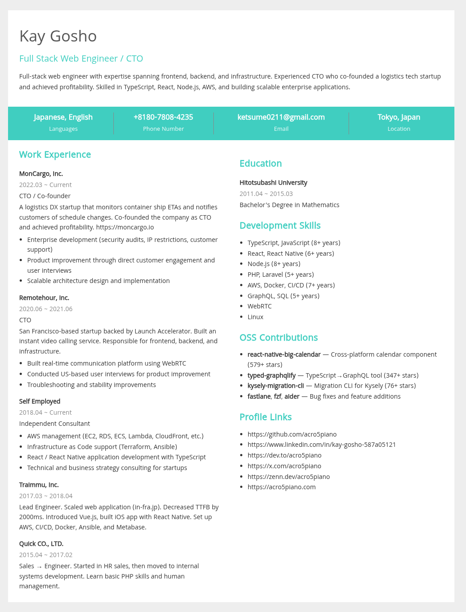

# Resume

Resume template for IT engineer



# How to use

```
yarn install
yarn watch
```

open localhost:3000 and you can see your first resume.

Write your resume. `src/app.postcss` is for css, `src/index.pug` is for template.

# Configuration

Write your Webpack config.
If you want to write your resume with sass, just add `sass-loader`

